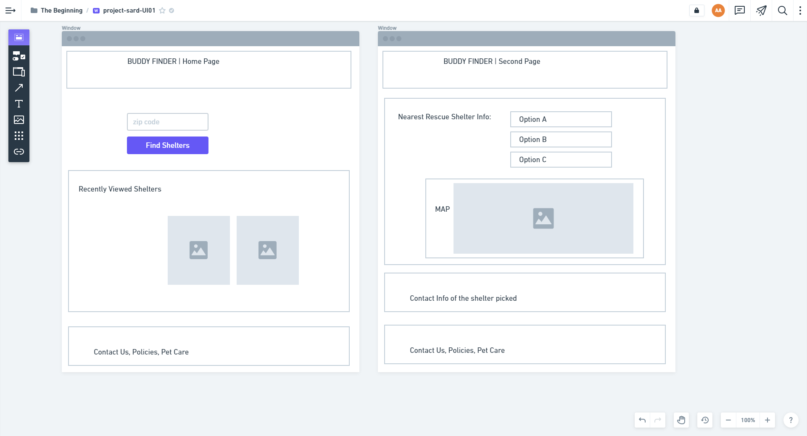

 

## **buddy-finder** 
 

[https://aranata.github.io/buddy-finder/](https://aranata.github.io/buddy-finder/) 
 
 

## description

***
Buddy Finder is a coding project done by team project-sard. Team members are: Sarah M, Richard Y, Dwayne H and Ali A. 
This is an application to find your new best friend. We are offering a search engine with a map to adopt the right pet for you. It is featuring a dynamically updated HTML and CSS powered by JavaScript code - and utilizing two server-side APIs: rescue groups, leaflet.js. 
 
 

## acceptance criteria

***

The codebase achieves the following criteria: 

*  
*  
*  
*  
*  
*  
*  

 
 

## usage

***

A full view of the page  
 

 
 

A short video that shows how the UI works. 
 

 
 

## some valuable references

***

These notes and links are listing some valuable references among others that I used doing this project: 
 

[https://jquery.com/](https://jquery.com/)

[https://getbootstrap.com/](https://getbootstrap.com/)

[https://developer.mozilla.org/](https://developer.mozilla.org/)

[https://favicon.io/favicon-generator/](https://favicon.io/favicon-generator/)

[https://fonts.google.com/?preview.text_type=custom](https://fonts.google.com/?preview.text_type=custom)

[https://fontawesome.com/](https://fontawesome.com/)

[https://shields.io/category/dependencies/](https://shields.io/category/dependencies/)

[https://www.screencastify.com/](https://www.screencastify.com/)

 
 

## credits

***

Stephen Woosley - Bootcamp Instructor 
Patrick Haberern - Bootcamp TA 
Tim Nagorski - Bootcamp TA 
Sean Walmer - Bootcamp TA 
 
 

## license

***

This is an assigment done under a bootcamp program, it is public but please contact the publisher before you use or 
change any content. 
ghibli.github@gmail.com
 
 

## badges

***

 
 

---
