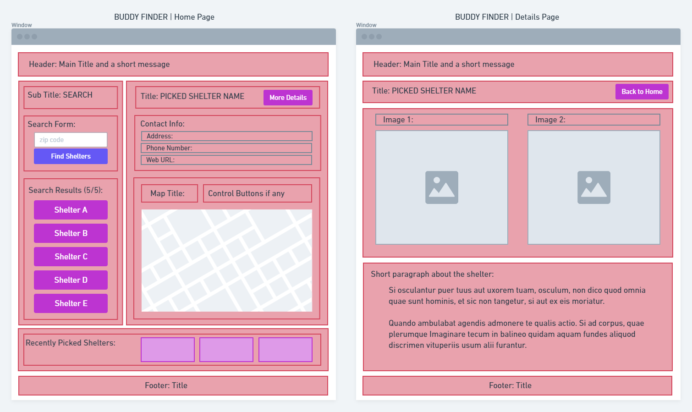

 

## **buddy-finder** 
 

[https://smakela13.github.io/project-buddy-finder/](https://smakela13.github.io/project-buddy-finder/) 
 
 

## description

***
Buddy Finder is a coding project done by the team SARD. Team members are: 
* Sarah M. - [https://github.com/smakela13/](https://github.com/smakela13/) 
* Richard Y - [https://github.com/Vinyl77/](https://github.com/Vinyl77/) 
* Dwayne H - [https://github.com/hov92/](https://github.com/hov92/) 
* Ali A - [https://github.com/AranATA/](https://github.com/AranATA/) 
 
This application is offering a search engine with a map to help you find your buddy. It retrieve the closest animal shelters' information and show the location of your pick on a map. It is featuring a dynamically updated HTML with Materialize CSS framework and powered by JavaScript code - utilizing two server-side APIs: petfinder and leaflet.js. 
 
 

## acceptance criteria

***

The codebase achieves the following criteria: 

*  
*  
*  
*  
*  
*  
*  

 
 

## usage

***

A wireframe showing the design of the page  
 

 
 

A short video that shows how the UI works. 
 

 
 

## some valuable references

***

These notes and links are listing some valuable references among others that we used doing this project: 
 

[https://materializecss.com/](https://materializecss.com/)

[https://www.petfinder.com/developers/](https://www.petfinder.com/developers/)

[https://leafletjs.com/index.html](https://leafletjs.com/index.html)

[https://www.mapbox.com/](https://www.mapbox.com/)

[https://developer.mozilla.org/](https://developer.mozilla.org/)

[https://favicon.io/favicon-generator/](https://favicon.io/favicon-generator/)

[https://fonts.google.com/?preview.text_type=custom](https://fonts.google.com/?preview.text_type=custom)

[https://fontawesome.com/](https://fontawesome.com/)

[https://shields.io/category/dependencies/](https://shields.io/category/dependencies/)

[https://www.screencastify.com/](https://www.screencastify.com/)

 
 

## credits

***

Stephen Woosley - Bootcamp Instructor 
Patrick Haberern - Bootcamp TA 
Tim Nagorski - Bootcamp TA 
Sean Walmer - Bootcamp TA 
 
 

## license

***

This is a group project done under a bootcamp program, it is public but please contact the publisher before you use or 
change any content. 
ghibli.github@gmail.com
 
 

## badges

***

 
 

---
