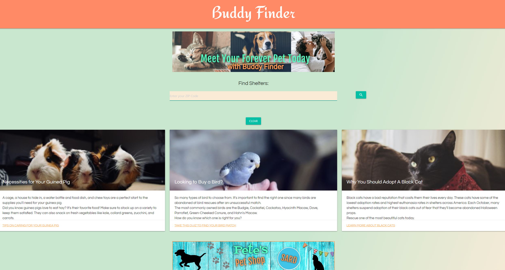

# Buddy Finder

## Description

*Buddy Finder is a website designed to find loving homes for abandoned pets. Project SARD aims to rescue all animals in need across the nation.*

Do you want to find a rescue animal to spend your life with?

With this website, you can find true companionship! 

This website allows you to search for nearby animal shelters within the United States by inputting the ZIP code of your choice. The information returned includes: a map of the searched area with a list of rescue shelters. When you click on a rescue shelter, you'll be given the organization's name, their location, a website, and the shelter's email address.

When you return back to the page, your search history will appear on the homepage. You'll be able to click on the shelter you'd like to get more information on again, and you will be directed to the shelter's website to so you can find the furry friend of your dreams.

Love is right around the corner! Search for your forever pet today.

Buddy Finder uses JavaScript, HTML, CSS, [Materialize CSS](https://materializecss.com/), [GoogleFonts](https://fonts.google.com/), [Material Icons](https://material.io/resources/icons/), and a [Favicon Generator](https://favicon.io/favicon-generator/). It uses the [Petfinder API](https://www.petfinder.com/developers/) to retrieve information on rescue shelters, [LeafletJS](https://leafletjs.com/) and [Mapbox](https://docs.mapbox.com/) to display the map for the selected shelters.

## Table of Contents

* [Description](#description)
* [Usage](#usage)
* [Wireframe](#wireframe)
* [Credits](#credits)
* [License](#license)

## Usage

The homepage of the website when a user first visits.

The search results page when the user has entered their ZIP code and have found a shelter that they would like to visit. A card with information shows the rescue shelter's contact details and a map with the shelter's location.

When the user returns to the website, they will see that the shelter they previously viewed now shows on the homepage. They can click on the button to visit the rescue shelter's website.

Navigate to [Buddy Finder](https://smakela13.github.io/project-buddy-finder) and view the web page.

## Wireframe

A wireframe showing the page's design. Wireframe was created using 

## Credits

Buddy Finder is a coding project done by Project SARD. The team members are:
* Soma Mäkelä - [https://github.com/smakela13/](https://github.com/smakela13/)
* Ali Aran - [https://github.com/AranATA/](https://github.com/AranATA/)
* Richard Yvarra - [https://github.com/Vinyl77/](https://github.com/Vinyl77/)
* Dwayne Hovington - [https://github.com/hov92/](https://github.com/hov92/)

## License

This website currently has No License, which means it is under exclusive copyright. No one can copy, distribute, or modify this website without permission.
